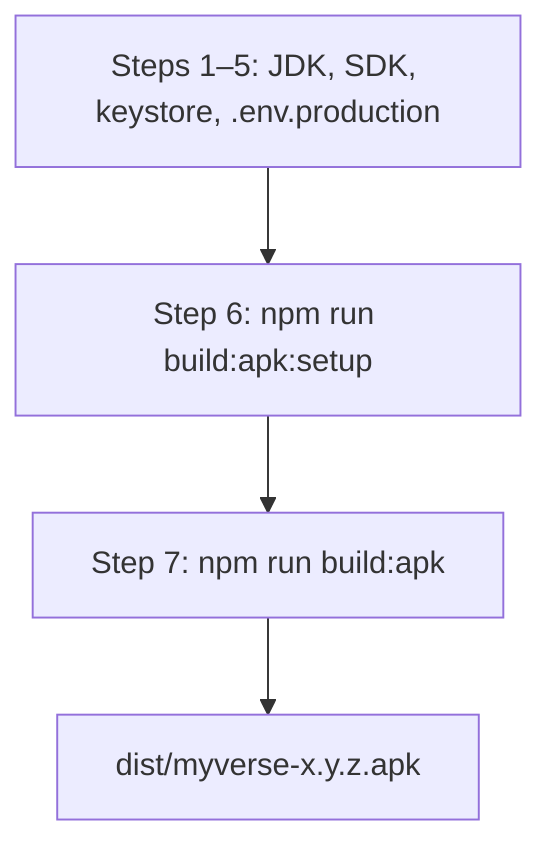

# Android Release APK — Local Build Guide

Build a signed MyVerse release APK on your machine without EAS cloud builds.

> **Read this whole “From zero to APK” section before running any commands.**  
> Do **not** jump straight to `npm run build:apk:setup` until steps 1–5 below are done.

---

## From zero to APK (first time on a machine)

Follow these steps **in order**.

### Step 1 — Clone and install dependencies

```bash
cd E:\projects\MyVerse    # your project path
npm install
```

### Step 2 — Install JDK 17

> **IMPORTANT:** Android Gradle builds require **JDK 17**. JDK 21 often fails.

1. Download and install [Eclipse Temurin JDK 17](https://adoptium.net/temurin/releases/?version=17)
2. Note the install folder — this becomes your `JAVA_HOME`:
   - Example: `C:\Program Files\Java\jdk-17`
   - It must contain `bin\java.exe` (Windows) or `bin/java` (macOS/Linux)

Verify:

```bash
"C:\Program Files\Java\jdk-17\bin\java" -version
```

You should see `openjdk version "17..."`.

### Step 3 — Install Android Studio + SDK

1. Download and install [Android Studio](https://developer.android.com/studio)
2. Run it once — default options are fine
3. Open **Settings → Languages & Frameworks → Android SDK**
4. Install **Android SDK Platform** (API 34+) and **SDK Build-Tools**
5. Copy **Android SDK Location** at the top — this becomes your `ANDROID_HOME`:
   - Example: `D:\Android`
   - Example (default Windows): `C:\Users\<you>\AppData\Local\Android\Sdk`

Verify — this file must exist:

```text
D:\Android\platform-tools\adb.exe
```

You do **not** need an emulator or virtual device to build a release APK.

### Step 4 — Create the release keystore (required)

> **IMPORTANT:** You need a keystore **before** you can build or install a release APK.  
> Without it you cannot sign the app. Use the **same keystore** for every update — if you lose it, users cannot install over an old build.

The keystore is a **file** (not a folder), usually ending in `.keystore`.

**Create the folder and generate the key:**

```bash
mkdir keystore

keytool -genkeypair -v -keystore keystore\myverse-release.keystore -alias myverse -keyalg RSA -keysize 2048 -validity 10000
```

macOS/Linux:

```bash
mkdir -p keystore
keytool -genkeypair -v -keystore keystore/myverse-release.keystore -alias myverse -keyalg RSA -keysize 2048 -validity 10000
```

**What `keytool` will ask you:**

| Question | What to enter |
|----------|---------------|
| Keystore password | Choose a password — **write it down** (needed every build) |
| Re-enter password | Same password |
| Key password | Press Enter to use the same password as the keystore |
| First and last name, org, etc. | Any values — fine for internal/testing builds |

**Remember and store securely:**

- Keystore file path: `keystore/myverse-release.keystore`
- Alias: `myverse`
- Keystore password
- Key password (if different)

Never commit the `.keystore` file or passwords to git.

If your team already has a shared release keystore, copy it to `keystore/myverse-release.keystore` instead of generating a new one.

### Step 5 — Set the production API URL

Release APKs **bake in** the API URL at build time. Use production, not localhost.

```bash
copy .env.production.example .env.production
```

Default in `.env.production`:

```
EXPO_PUBLIC_API_URL=https://myverse.redvalky.in/api/v1
```

Do **not** ship a release APK built with `localhost` in this file.

### Step 6 — Save your machine paths (`npm run build:apk:setup`)

Now run the setup wizard. It saves JDK/SDK/keystore paths to `android.build.env` (gitignored).

```bash
npm run build:apk:setup
```

The wizard asks for paths it auto-detected. Text in `[brackets]` is the suggested value — press **Enter** to accept.

| Prompt | Example | What it is |
|--------|---------|------------|
| `JAVA_HOME` | `C:\Program Files\Java\jdk-17` | JDK 17 install folder (step 2) |
| `ANDROID_HOME` | `D:\Android` | Android SDK folder (step 3) |
| `KEYSTORE_PATH` | `./keystore/myverse-release.keystore` | Keystore **file** from step 4 |
| `KEYSTORE_ALIAS` | `myverse` | Alias you used in `keytool` |
| `OUTPUT_DIR` | `./dist` | Where the APK is copied — default is fine |

If the keystore file from step 4 is missing, the wizard offers to run `keytool` for you — say **y**.

**Skip the wizard?** Copy and edit manually:

```bash
copy android.build.env.example android.build.env
```

### Step 7 — Build the APK

```bash
npm run build:apk
```

The script will:

1. Verify JDK and SDK paths
2. Load `.env.production`
3. Generate `android/` via Expo prebuild (first time only)
4. Ask for your **keystore password** (from step 4)
5. Run Gradle release build
6. Copy APK to `dist/myverse-<version>.apk`

First build may take several minutes (Gradle downloads dependencies).

### Step 8 — Install on a phone

Transfer `dist/myverse-1.0.0.apk` to the device, or install via USB:

```bash
"D:\Android\platform-tools\adb.exe" install -r dist\myverse-1.0.0.apk
```

Enable “Install from unknown sources” if sideloading manually.

---

## Quick reference (after first-time setup)

```bash
npm run build:apk          # build release APK → dist/
npm run build:apk -- --clean        # regenerate native android/ folder
npm run build:apk -- --skip-prebuild   # faster rebuild (JS-only changes)
```

Output: `dist/myverse-<version>.apk`

---

## Overview



The `android/` folder is **generated** (gitignored). The build script creates it via `expo prebuild` on first run.

| Command | When to use |
|---------|-------------|
| `npm run build:apk:setup` | After steps 1–5, to save machine paths |
| `npm run build:apk` | Every release build |
| `npm run build:apk -- --clean` | After changing `app.json` plugins, icons, native config |
| `npm run build:apk -- --skip-prebuild` | JS/TS-only changes, `android/` already current |
| `npm run build:apk -- --bundle` | Optional AAB + bundletool path (Play Store style) |

---

## Setup wizard details

### What each path means

**JAVA_HOME** — folder where JDK 17 is installed. Gradle uses this to compile. **Not** bundletool. **Not** Android Studio.

**ANDROID_HOME** — Android SDK root. Must contain `platform-tools/`, `build-tools/`, `platforms/`.

**KEYSTORE_PATH** — path to the `.keystore` **file** you created in step 4.

**KEYSTORE_ALIAS** — the `-alias` value from your `keytool` command (default `myverse`).

### What the wizard does *not* ask for

| Item | When needed |
|------|-------------|
| **Bundletool** | Only with `npm run build:apk -- --bundle`. Default build does not need it. |
| **Keystore password** | At **build time** (`npm run build:apk`), not during setup |

### `android.build.env` reference

| Variable | Purpose |
|----------|---------|
| `JAVA_HOME` | JDK 17 folder (contains `bin/java.exe`) |
| `ANDROID_HOME` | Android SDK folder |
| `KEYSTORE_PATH` | Release `.keystore` file |
| `KEYSTORE_ALIAS` | Key alias inside keystore |
| `KEYSTORE_PASSWORD` | Optional — leave blank to prompt at build time |
| `KEY_PASSWORD` | Optional — leave blank to prompt at build time |
| `OUTPUT_DIR` | APK output folder (default `./dist`) |
| `BUNDLETOOL_JAR` | Optional — only for `--bundle` |

---

## What `npm run build:apk` does internally

| Step | Action |
|------|--------|
| 1 | Load `android.build.env` |
| 2 | Verify JDK and Android SDK |
| 3 | Load `.env.production` for `EXPO_PUBLIC_API_URL` |
| 4 | `expo prebuild --platform android` if `android/` missing |
| 5 | Write signing config, prompt for keystore password |
| 6 | `gradlew :app:assembleRelease` |
| 7 | Copy to `dist/myverse-<version>.apk` |

---

## Alternative: AAB + bundletool (`--bundle`)

Only if you want the Play Store bundle pipeline (similar to pralaypaar):

1. Download [bundletool](https://github.com/google/bundletool/releases) → `tools/bundletool-all.jar`
2. Set `BUNDLETOOL_JAR=./tools/bundletool-all.jar` in `android.build.env`
3. Run: `npm run build:apk -- --bundle`

Default `npm run build:apk` builds an APK directly — no bundletool required.

---

## Gitignored build artifacts

| Path | Purpose |
|------|---------|
| `android/` | Native project from prebuild |
| `android/keystore.properties` | Signing credentials (written each build) |
| `android.build.env` | Your machine paths |
| `keystore/*.keystore` | Release signing key |
| `dist/*.apk` | Build output |
| `.env.production` | Production API URL |

---

## Troubleshooting

### Keystore not found / build asks for a file that doesn't exist

Run step 4 again:

```bash
keytool -genkeypair -v -keystore keystore\myverse-release.keystore -alias myverse -keyalg RSA -keysize 2048 -validity 10000
```

Or re-run `npm run build:apk:setup` and choose **y** when offered to create the keystore.

### "Invalid or missing token" in the release app

Built with a dev API URL. Check `.env.production` and rebuild.

### Gradle fails with JDK 21

Install JDK 17 and update `JAVA_HOME` in `android.build.env`.

### `expo prebuild` fails

- Run `npm install`
- Try `npm run build:apk -- --clean`

### Install fails: "App not installed"

- Uninstall any debug build with a different signature first
- Must use the same keystore for updates

### Build is slow

First build downloads Gradle deps. Later builds: `npm run build:apk -- --skip-prebuild` for JS-only changes.

---

## Updating version for a new release

1. Bump `version` in `package.json` and `app.json`
2. Increment `android.versionCode` in `app.json`
3. Run `npm run build:apk`

---

## Key files

| File | Purpose |
|------|---------|
| `scripts/build-android.mjs` | Build orchestrator |
| `android.build.env.example` | Machine config template |
| `.env.production.example` | Production API URL template |
| `keystore/README.md` | Pointer to keystore instructions |
| `app.json` | `android.package`, `versionCode`, icons |

---

## Manual test checklist

- [ ] Steps 1–5 completed before setup
- [ ] `keystore/myverse-release.keystore` exists
- [ ] `.env.production` exists with production API URL
- [ ] `npm run build:apk:setup` saves paths
- [ ] `npm run build:apk` produces `dist/myverse-*.apk`
- [ ] APK installs and login works on a physical device
