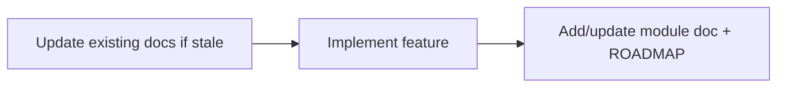

# Frontend Documentation Conventions

> How we write and maintain MyVerse frontend docs.

## Structure

| File | Purpose |
|------|---------|
| [README.md](./README.md) | Index, environment setup |
| [ROADMAP.md](./ROADMAP.md) | Slice status table — links to module docs, no flow duplication |
| [DOCS.md](./DOCS.md) | This file — maintenance rules |
| [AUTH.md](./AUTH.md) | Authentication module |
| [PROJECT.md](./PROJECT.md) | Projects module |
| [STAFF.md](./STAFF.md) | Staff module |
| [UX.md](./UX.md) | Save/action feedback patterns (toasts, spinners) |
| [MEDIA.md](./MEDIA.md) | Media upload module |
| [BUILD_ANDROID.md](./BUILD_ANDROID.md) | Local Android release APK build |

Add new module docs as features land (e.g. `USERS.md` for Slice 5).

## Rules

1. **One doc per domain** — name it after the module (`PROJECT.md`, not `SLICE_1.md`).
2. **Update with code** — change the module doc in the same PR/commit as related frontend code.
3. **ROADMAP stays high-level** — slice status + links only; detailed flows live in module docs.
4. **Link backend + Postman** — each module doc should reference matching backend docs and Postman folder.
5. **Living docs** — when behavior changes (e.g. FAB moved from Admin to Projects tab), update the module doc immediately.
6. **Save feedback** — new save or in-place action flows must declare a `SaveFeedbackPattern` in code and be listed in [UX.md](./UX.md).

## Module doc template

Each module doc should include:

- Overview (what the module does)
- User flows (admin, consumer, staff self-service as applicable)
- API map (endpoints used by the frontend)
- Frontend routes and key files
- Permissions matrix
- Manual test checklist
- Prerequisites (env, CORS, seeded data)
- Known backend gaps (if any)

## Workflow for new features

1. **Before** — fix outdated docs that the feature will touch.
2. **During** — optional stub sections in the target module doc.
3. **After** — complete module doc, update ROADMAP status, update README index.
