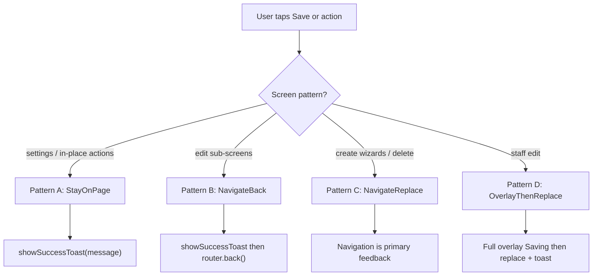

# Save & Action Feedback (Frontend)

> How MyVerse confirms successful saves and in-place actions across web and native.

**Related:** [DOCS.md](./DOCS.md) · [AUTH.md](./AUTH.md) · [PROJECT.md](./PROJECT.md) · [STAFF.md](./STAFF.md)

---

## Overview

The app uses a **custom toast/snackbar** (no third-party dependency):

| File | Role |
|------|------|
| `src/stores/toast-store.ts` | Zustand store — `showSuccessToast`, `showWarningToast`, `showErrorToast`, auto-dismiss ~3s |
| `src/components/ui/app-toast.tsx` | `AppToastHost` — root overlay, semantic green/amber/red from theme |
| `src/lib/save-feedback.ts` | `SaveFeedbackPattern` enum, `runSaveAction()`, `showStaySuccess()` |

`AppToastHost` is mounted once in `src/app/_layout.tsx` (last child inside `SafeAreaProvider`) so toasts **survive `router.back()`** and appear above the stack.

**Do not use** `Alert.alert` for success feedback.

Toast colors use global semantic tokens from `src/constants/theme.ts`:

| Variant | Light | Dark |
|---------|-------|------|
| Success | `#16A34A` (green) | `#22C55E` |
| Warning | `#D97706` (amber) | `#F59E0B` |
| Error | `#DC2626` (red) | `#F87171` |

All toast variants use white text/icons on the colored background.

Enter/exit uses Reanimated (`FadeInUp` / `FadeOutDown`) — slide up + fade in (~250ms), slide down + fade out (~200ms) on dismiss or auto-dismiss.

---

## Pick a pattern first

Before wiring a new save handler, choose one pattern:



| Pattern | When | Success feedback |
|---------|------|------------------|
| **A — StayOnPage** | User remains on the same screen | Toast required |
| **B — NavigateBack** | Dedicated edit screen → parent hub | Toast at root (survives `back()`) + navigation |
| **C — NavigateReplace** | Wizard finish, create → detail, delete | Landing screen / new route is feedback; toast optional |
| **D — OverlayThenReplace** | Long multi-field save (staff edit) | Full-screen overlay + navigate; toast on destination |

---

## Web vs native

Same API and component. Differences are **layout only**:

| Concern | Native | Web |
|---------|--------|-----|
| Toast position | Bottom, `useSafeAreaInsets().bottom` + tab bar offset | Bottom-center, fixed above viewport bottom |
| Survives navigation | Yes — host in root `_layout.tsx` | Yes — same host |
| Back-as-confirmation | Stack animation helps | Flatter transition — toast matters **more** on web for Pattern B |
| Success `Alert.alert` | Do not use | Do not use |

---

## Implementation helpers

### `runSaveAction()`

Centralizes async save UX for form saves:

```typescript
await runSaveAction({
  pattern: SaveFeedbackPattern.StayOnPage,
  successMessage: 'Profile saved',
  minSpinnerMs: 350, // avoids spinner blink on fast APIs
  action: () => updateMeApi(...),
  onSuccess: () => { /* e.g. router.back() for Pattern B */ },
});
```

- **`minSpinnerMs`** (default 350): applied only when a spinner is shown (`SaveFormLayout` / overlay). Set `useMinSpinner: false` or `minSpinnerMs: 0` for instant actions.
- **Errors**: rethrow; caller keeps inline `formError` (existing behavior).

### `showStaySuccess()`

Fire-and-forget toast for lightweight in-place actions (reorder) — no minimum spinner delay.

---

## Screen inventory

| Route / action | Pattern | Success message |
|----------------|---------|-----------------|
| `/profile` — Save | A | Profile saved |
| `/project/[id]/manage` — Publish project | A | Project published |
| `/project/[id]/sections/[sectionId]/edit` — Publish/unpublish | A | Section published / Section unpublished |
| `/project/[id]/sections` — Reorder | A (optional) | Order saved |
| `/project/.../items` — Reorder | A (optional) | Order saved |
| `/project/[id]/edit` — Save | B | Project updated |
| `/project/.../sections/[sectionId]/edit` — Save fields | B | Section updated |
| `/project/.../items/create` — Save | B | Item saved |
| `/project/.../items/[itemId]/edit` — Save | B | Item saved |
| `/project/.../items/add-photo` — Upload | B | Photo added |
| `/staff/[id]/edit-account` — Save | B | Account updated |
| Create book/photoshoot wizards | C | (navigation only) |
| `/project/[id]/sections/create` | C | (navigation only) |
| Section/project delete | C | (navigation only) |
| `/staff/edit` — Save | D | Profile saved (toast persists on `/staff/:id`) |

---

## Rules for new screens

1. **Pick a pattern** before implementing `handleSave` or action handlers.
2. Add a one-line comment: `// SaveFeedbackPattern.StayOnPage — see docs/UX.md`
3. Prefer **`runSaveAction` in screen handlers** — keep `SaveFormLayout` dumb (spinner + inline errors only).
4. Use **`showStaySuccess`** for instant taps (reorder) without spinner delay.
5. Update this doc's screen inventory when adding new save flows.

---

## Manual test checklist

1. **Profile** — change display name → Save → toast "Profile saved", stay on page
2. **Project edit** — save → toast + back to manage hub; toast visible on manage
3. **Section publish** — toggle on edit screen → toast, stay, badge updates
4. **Manage publish** — toast, status badge updates
5. **Fast API** — spinner visible ≥350ms on form saves (not on reorder)
6. **Web** — repeat profile + project edit; toast not clipped by tab bar
7. **Error path** — failed save shows inline error, no success toast
8. **Staff edit** — overlay while saving → toast on staff detail after replace
